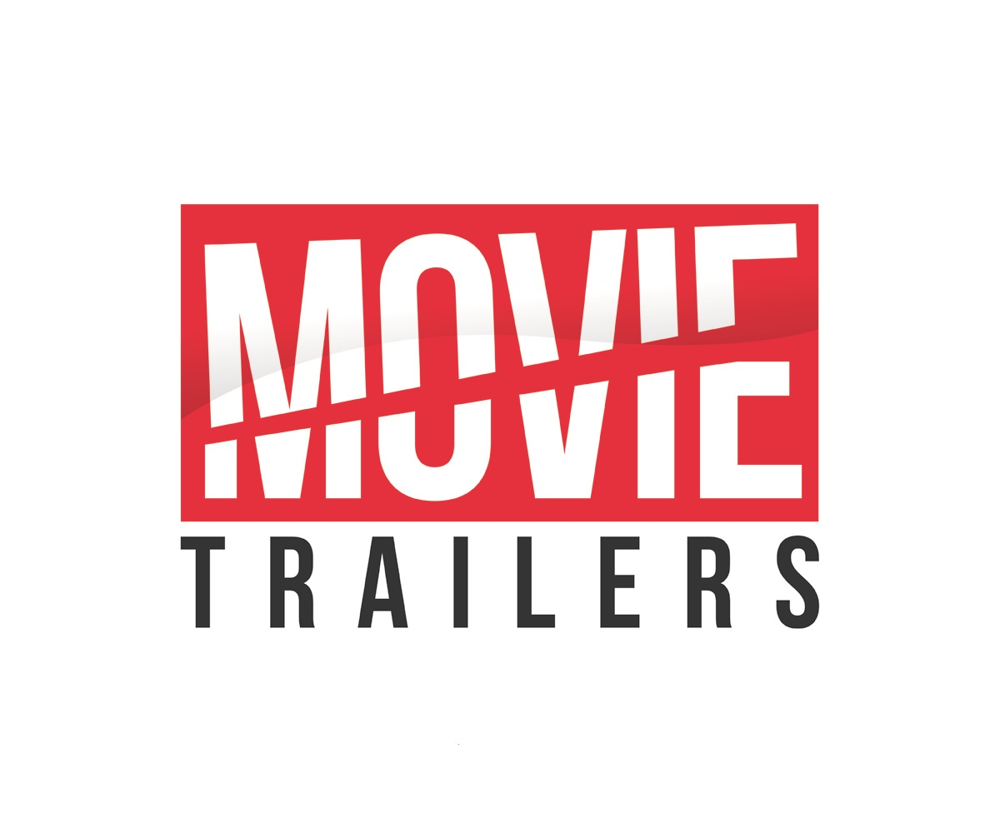
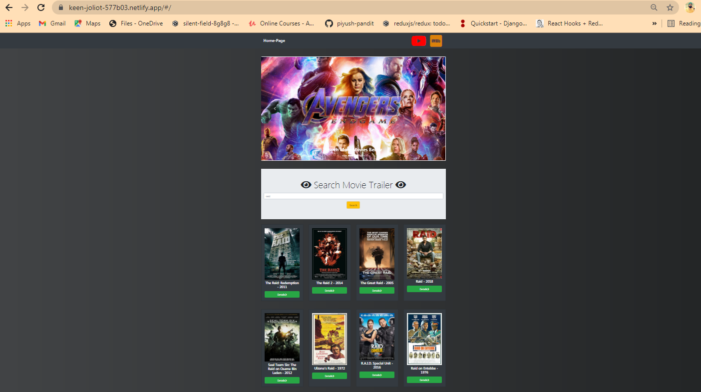

[![LinkedIn][linkedin-shield]][linkedin-url]


<!-- PROJECT LOGO -->
<br />
<p align ="center">
    
  <h3 align ="center">Movie-Trailer</h3>

  <p align ="center">
    An awesome task which allowed me to understand 3rd party API working and make own WebAPI using React.js!
    <br />
    <br />
    <a href="https://keen-joliot-577b03.netlify.app">View Demo</a>
    ·
    <a href="https://github.com/piyush-pandit/">Report Bug</a>
    ·
    <a href="https://github.com/piyush-pandit/">Request Feature</a>
  </p>
</p>


<!-- TABLE OF CONTENTS -->
## Table of Contents

* [About the Project](#about-the-project)
  * [Built With](#built-with)
* [Getting Started](#getting-started)
  * [Prerequisites](#prerequisites)
  * [Installation](#installation)
* [Usage](#usage)
* [Roadmap](#roadmap)
* [Deployment](#Netlify-Deployment)
* [Contributing](#contributing)
* [Contact](#contact)


<!-- ABOUT THE PROJECT -->
## About The Project




This project will help you in searching any related trailers of a movie which you desire and u will be able to watch the trailer and also can read the details and description regarding that movie which will be fetched directly from the official IMDb site. 

Here's why you should love this assignment:
* I am fluent in React.js, learning next.js and also Vue.js for better graphics and functionality.
* Getting to know Funfacts about API's and creating own api was fun and insightful, this is the very first implementation of the same.
* I have used OMDb's api to fetch the list of movies details which u will click on and used rapid Api (3rd party) for fetching data of movies and also its Youtube trailer from that api only and created a seperate own api to aggregate both the api's and work the functionalities.
* You will find good code quality and code standards which can be used to demonstrate to beginners, if not no issues as we are in an agile world. Learning continously:)


A list of commonly used resources that I find helpful are listed in the acknowledgements.

### Built With
This application is built with love, dedication, coffee and:
* [IMDb](https://rapidapi.com/marketplace)
* [Google cloud api](https://console.cloud.google.com/apis)
* [OMDB Api](http://www.omdbapi.com/)


<!-- GETTING STARTED -->
## Getting Started

To get a local copy up and running follow these simple example steps.

### Prerequisites


* React and it's Modules
```sh
React-router-dom
react-redux
react-bootstrap
```

### Installation

1. Get an API Key at :-

    for IMDb [https://rapidapi.com/marketplace](https://rapidapi.com/marketplace)

2. Clone the repo
```sh
git clone https://github.com/piyush-pandit/movie-trailer-react.git
```

3. Run the application
```React
npm start
```


<!-- USAGE EXAMPLES -->
## Usage

_For more examples, please refer to the [Documentation](https://github.com/piyush-pandit/movie-trailer-react)


<!-- ROADMAP -->
## Roadmap

See the [open issues](https://github.com/piyush-pandit/movie-trailer-react/issues) for a list of proposed features (and known issues).


<!-- DEPLOYMENT -->
## Deployment

Basic Outline of Deploying on AWS would be be following steps:-
* Step 1: Add Your New Site
* Step 2: Link to Your GitHub (or supported version-control tool of choice)
* Step 3: Authorize Netlify
* Step 4: Select Your Repo
* Step 5: Configure Your Settings
* Step 6: Build Your Site
* Step 7: All Done Deployed Your Application and you will get your URL Link on the Top.


For detailed installation you can go through this [Link](https://www.netlify.com/blog/2016/09/29/a-step-by-step-guide-deploying-on-netlify/) or  
You can also watch this video for easy understanding of deployment. [video link](https://youtu.be/gaC-l9MAE9Q)


<!-- CONTRIBUTING -->
## Contributing

Contributions are what make the open source community such an amazing place to be learn, inspire, and create. Any contributions you make are **greatly appreciated**.

1. Fork the Project
2. Create your Feature Branch (`git checkout -b feature/AmazingFeature`)
3. Commit your Changes (`git commit -m 'Add some AmazingFeature'`)
4. Push to the Branch (`git push origin feature/AmazingFeature`)
5. Open a Pull Request


<!-- CONTACT -->
## Contact

Piyush Pandit - [@an_orthodox_p.p](https://www.instagram.com/an_orthodox_p.p/) - My Instagram  
Piyush Pandit - [piyush-pandit-49b7501ba](https://www.linkedin.com/in/piyush-pandit-49b7501ba/) - My LinkedIn  
Project Link: [https://github.com/piyush-pandit/movie-trailer-react]https://github.com/piyush-pandit/movie-trailer-react)  


<!-- MARKDOWN LINKS & IMAGES -->
<!-- https://www.markdownguide.org/basic-syntax/#reference-style-links -->


[linkedin-shield]: https://img.shields.io/badge/-LinkedIn-black.svg?style=flat-square&logo=linkedin&colorB=555
[linkedin-url]: https://www.linkedin.com/in/piyush-pandit-49b7501ba/
[product-screenshot]: images/screenshot.png
